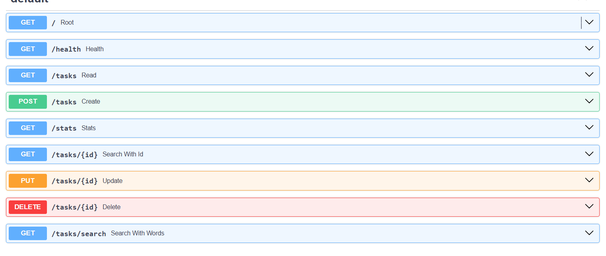
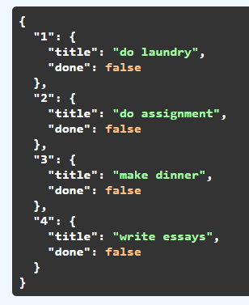

# CRUD API in FastAPI
A simple REST API built with Python and FastAPI for managing tasks.

The API supports the basic CRUD operations:

    Create tasks
    Read all tasks or a single task
    Update tasks
    Delete tasks

## Installation & Running

### Install the required dependencies:

     `pip install fastapi uvicorn`

Run the API with:
 
    `fastapi run Tasks.py`

The API will be available at:

    `http://localhost:8000`

Interactive Swagger API documentation is available at:

    `http://localhost:8000/docs`

## All the endpoints in the documents

## Example Request

### Create a new task:

    `curl -i -X POST http://localhost:8000/tasks \
    -H "Content-Type: application/json" \
    -d '{"title":"Buy milk"}'`

    
### Output:
    Added Buy milk to tasks.

## The mortality experiment: 

Created all these tasks, but when we run the server again it will be gone because the current implementation stores tasks in memory, so the data is reset whenever the server restarts as the code runs from the start of the script. When we will add an external database, it safely store our data but will take up space which we have to provide.

# AI's Code implementation

    `Create a simple back-end CRUD API in FastAPI without a database where we can create task, read them, delete and update them, make the basic CRUD operation with proper error handling and basic pydantic data validation and return the apporiate status code at the success of the operation. 
    a in memory dictionary with the id, title and done boolean variable of the task
    Post request will assign the id number itself with a global count
    Make two endpoints
    1) simple health checkpoint where you return status tell whether the API  is working or not
    2) root endpoint which gives the description of the api in JSON format
    Additional endpoints will be
    1. search based on a word like returning task with "milk" in them 
    2. search based on id 
    3. Stats total count and how many are tasks done or not `

